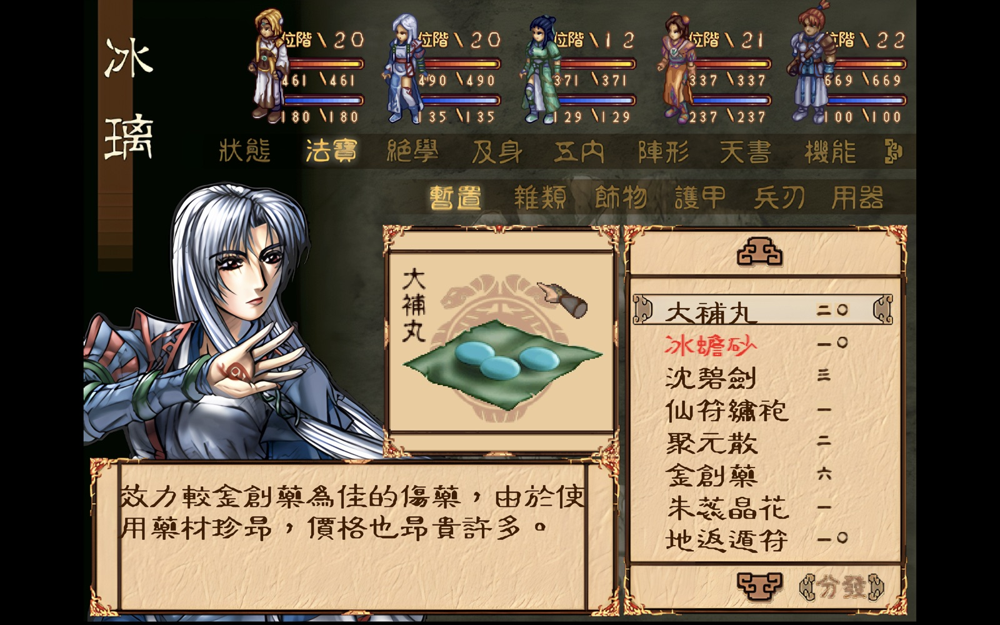
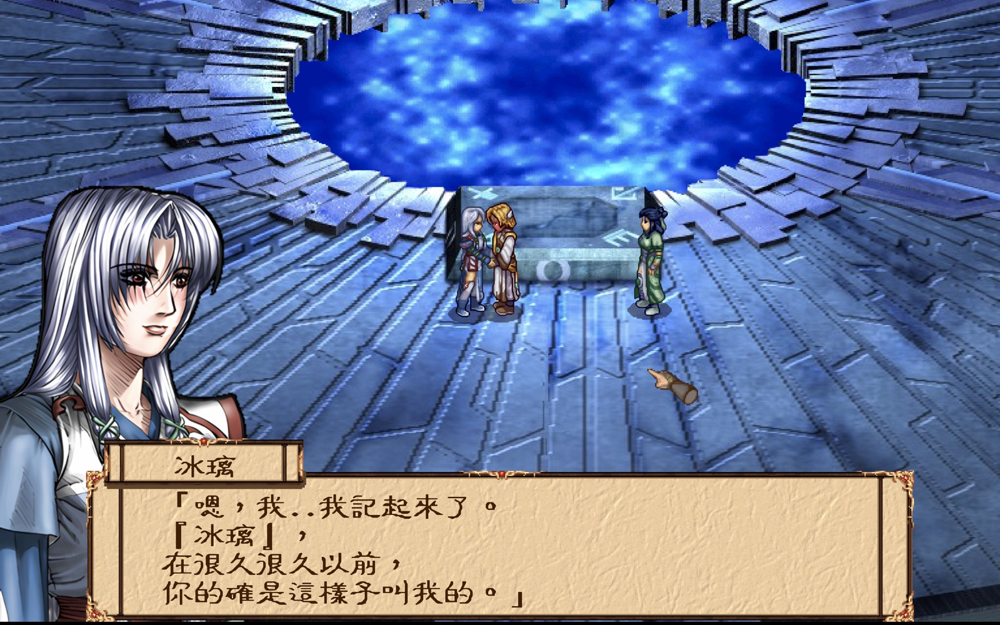
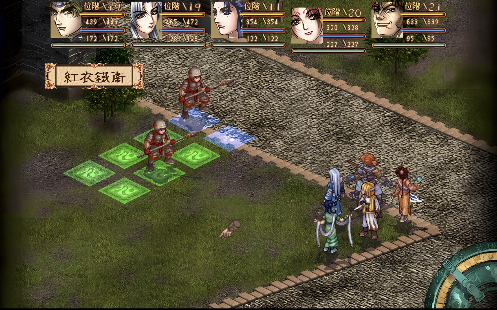
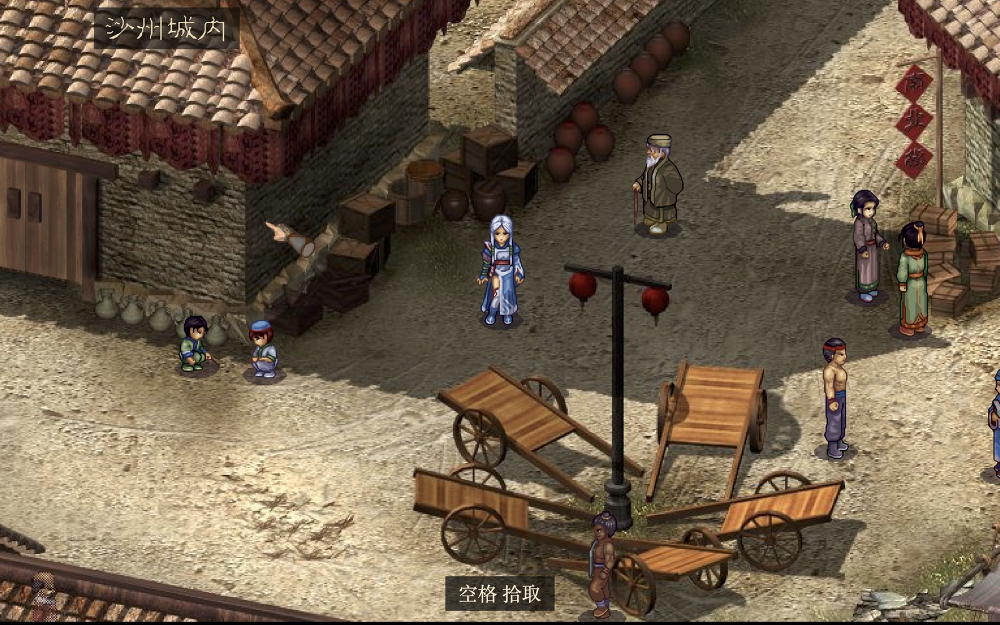
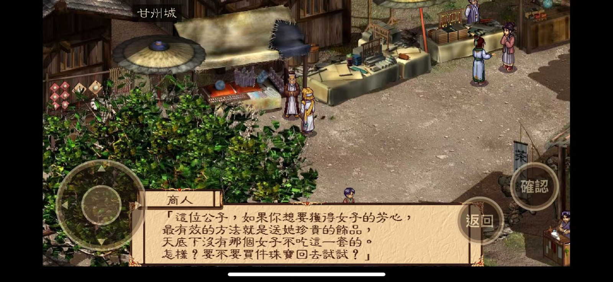

# DynastyReforge · 幽城幻劍錄 重光

用现代网页技术（Phaser 3）重新实现的《幽城幻劍錄》（漢堂國際，2001）。剧情、地图、战斗、菜单、存档按原作逐项复刻，存档与原作的 `SaveNNN.TSF` 互通。可以在浏览器、桌面（Mac / Windows）和 iPhone 上玩。

> **本仓库不含任何原作素材。** 你需要自己有一份原作，用仓库里的提取工具在本机生成素材后才能玩。

欢迎 Star ⭐、Fork，遇到问题或有建议请提 [Issue](https://github.com/knightmarehs/DynastyReforge/issues)，也欢迎提交 Pull Request。

## 截图

| | |
|---|---|
| <br>高清：AI 放大立绘、平滑字体 | <br>宽屏：地图铺满屏幕 |
| <br>宽屏：战场放宽、两侧补边 | <br>地图上可切换操作角色 |
| <br>iPhone：原版画质、触屏按键 | |

## 能玩到什么

- 完整游戏：地图探索与剧情、对白与影片、遇敌、战斗到结算、菜单（物品、装备、五内、阵形、天书存读档）、商店、客栈、炼化与魂石
- 繁体（默认）/ 简体，标题页切换
- 宽屏（电脑默认）、全键盘操作、手柄（Xbox / PS / Switch Pro）、手机触屏按键
- 高清渲染：画面按屏幕分辨率画，人物与文字实时平滑；另可加 AI 放大的立绘、战斗背景、菜单界面（见“高清素材”）
- 标题页可切换“成長：最大/隨機（原作）”“掉寶：必定/機率（原作）”，默认最大、必定
- 原作中缺少资源或机制不明的五门特殊技能暂时封印（妖光邪眼〈羽魅版〉、非天死潭、封炎灭阵、伥魂大法、幽魄厉界）

## 你需要准备

### 1. 原作

**台湾第三版硬盘版**（安装目录里有 `Dynasty/Castle/exe/RPG.exe` 和 `Dynasty/Castle/multimedia/`）。

可以在这里下载 通过网盘分享的文件：幽城完美中文硬盘版
链接: https://pan.baidu.com/s/1tMSLOUfcJnKjKBefTBrNNA?pwd=9mrj 提取码: 9mrj

- `RPG.exe` 用原版 `RPG.exe`，或 2in1 / 3in1 / 5in1 任一款免 CD 补丁中的都可以。
- `multimedia/` 下的文件会逐个核对指纹；装了 MOD（如“300 块版”）的安装目录会被拒绝，并提示版本不对。

### 2. 软件

| 软件 | 版本 | 用途 |
|---|---|---|
| [Git](https://git-scm.com/) | 任意 | 下载代码 |
| [Node.js](https://nodejs.org/) | 20.19 以上（或 22.12 以上） | 运行游戏 |
| [Python](https://www.python.org/) | 3.10 以上，再执行 `pip install pillow numpy` | 提取素材 |
| [ffmpeg](https://ffmpeg.org/) | 任意，命令行能直接运行 `ffmpeg` | 转换影片 |

Mac 可用 [Homebrew](https://brew.sh/)：`brew install git node python ffmpeg`。
Windows 可用：`winget install Git.Git OpenJS.NodeJS.LTS Python.Python.3.12 Gyan.FFmpeg`，装完重开命令行窗口。

> 提取工具目前只在 Mac 上完整测试过；Mac 与 Windows 的安装包都已实测可玩。

## 安装与提取

```bash
git clone https://github.com/knightmarehs/DynastyReforge.git
cd DynastyReforge
cd game && npm install && cd ..
```

提取素材（多核电脑约 20 分钟，核数少会更久；生成约 2.1 GB 到 `game/public/`）：

```bash
python3 tools/extract.py --castle "<原作安装目录>/Dynasty/Castle" --out game/public
```

- Windows 把 `python3` 换成 `python`，路径用引号括起来，例如 `"C:\Games\幽城幻剑录\Dynasty\Castle"`。
- 中途断了，再跑同一条命令会从断点继续。
- 最后看到 `✔ 完成` 就可以玩了。简体字库与简体界面用仓库自带的 `patches/chs` 生成。

## 高清素材（可选）

不做这一步也能玩，画面已经比原作清楚（高清渲染 + 平滑）。加上 AI 放大的立绘、战斗背景、菜单界面更清楚，约 820 个文件、400 MB。两种方式任选：

**A. 自己生成**（需要支持 Vulkan 的显卡，Mac 可直接用）

1. 到 [Real-ESRGAN 发布页](https://github.com/xinntao/Real-ESRGAN/releases/tag/v0.2.5.0) 下载对应系统的 `realesrgan-ncnn-vulkan-*.zip` 并解压（自带模型，不用装别的）。
2. 提取命令后面加上程序路径：

```bash
python3 tools/extract.py --castle "<原作安装目录>/Dynasty/Castle" --out game/public \
  --hd-esrgan "<解压目录>/realesrgan-ncnn-vulkan"
```

Windows 下程序名是 `realesrgan-ncnn-vulkan.exe`。已经提取过的话，再跑一次只会补做高清这一步。

**B. 用别人生成好的高清素材包**

```bash
python3 tools/extract.py --castle "<原作安装目录>/Dynasty/Castle" --out game/public --hd-pack 高清素材包.zip
# 或者已经提取完了，直接装：
python3 tools/hd_pack.py install 高清素材包.zip game/public
```

高清默认开启。标题页“畫面”可切换高清/原版，网页版也可以在网址后加 `?hd=0` 看原版。

## 开始玩

**浏览器**

```bash
cd game && npm run dev
```

打开 <http://localhost:5180>。存档默认存在浏览器里，标题页可以“选择文件夹”，直接读写原作的 `Save` 目录。

**桌面版**

```bash
cd game && npm run build && cd ../desktop && npm install && npm start
```

打成可以直接运行的安装包（在 `desktop/release/`）：

- Mac：`npm run dist:mac`，生成 Intel 与 Apple 芯片通用的 `.dmg`
- Windows：`npm run dist:win`，生成免安装的 `.zip`，解压后双击 `幽城幻劍錄.exe`

存档默认放在“文稿/幽城幻劍錄/存档”。

> 打出来的安装包里含有从原作提取的素材，只供自己使用，请不要公开分发。

**iPhone**（需要 Mac + Xcode + Apple ID）

```bash
cd game && npm run build && cd ../mobile && npm install && npm run sync && npm run open
```

在 Xcode 里选 App → Signing & Capabilities → Team 选自己的 Apple ID，顶部选手机，点运行。手机版固定原版画质；用免费账号安装，每 7 天要重新运行一次。存档在“文件” App 的 幽城幻劍錄 文件夹里，可以用访达拖进拖出。

打成不签名的 `.ipa`（给没有 Mac 的人用 Sideloadly 自己签名安装，见下）：

```bash
cd game && npm run build && cd ../mobile && npm install && npx cap copy ios
cd ios/App && xcodebuild -project App.xcodeproj -scheme App -configuration Release \
  -destination 'generic/platform=iOS' -derivedDataPath build CODE_SIGNING_ALLOWED=NO build
mkdir Payload && cp -R build/Build/Products/Release-iphoneos/App.app Payload/ && zip -qry 幽城幻劍錄.ipa Payload
```

**用 Sideloadly 安装 `.ipa`**（Windows / Mac 都可以，用自己的免费 Apple ID）

1. 安装 [Sideloadly](https://sideloadly.io/)。Windows 还要装 iTunes 和 iCloud 的**官网下载版**（不是微软商店版）。
2. 手机用数据线连电脑，在手机上点“信任此电脑”。
3. 打开 Sideloadly，把 `.ipa` 拖进窗口，Apple ID 一栏填自己的，点 Start；按提示输入密码和验证码。
4. 手机上打开“设置 → 通用 → VPN 与设备管理”，信任自己的 Apple ID。iOS 16 以上还要打开“设置 → 隐私与安全性 → 开发者模式”，手机会重启一次。
5. 免费 Apple ID 签的 App **7 天后打不开**，用 Sideloadly 重新装一次即可。**直接覆盖安装，不要先删 App**，否则存档会跟着删掉；保险起见，重装前先在“文件”App 的 幽城幻劍錄 文件夹里把存档复制出来。

## 操作

| 操作 | 键盘 | 鼠标 |
|---|---|---|
| 移动 / 选择 | 方向键 | 按住右键走路 |
| 确认、交谈 | 空格或回车 | 左键 |
| 菜单、返回 | Esc | 右键 |
| 走 / 跑切换 | Shift | — |
| 快进对白 | Ctrl | — |
| 菜单翻页 | `[` `]` | — |
| 切换菜单队员 | Tab | — |

手柄按位置映射，Xbox / PS / Switch Pro 通用：摇杆或十字键移动，**下方键**确认，**右方键**或 Start 返回、开菜单。手机上是左下摇杆、右下「確認」「返回」。

## 常见问题

- **“原作目录与已验证的官方版不一致”**：不是台湾第三版，或装了 MOD。会列出哪些文件不同。
- **“缺少 pillow, numpy”**：用运行提取的同一个 Python 执行 `pip install pillow numpy`。
- **影片一步失败**：没装 ffmpeg，或者命令行找不到它。装好后再跑同一条命令即可续上。
- **Mac 安装包第一次玩时没有声效**（已知问题，原因还在查）：读档也恢复不了，**退出游戏重新打开**即可。
- **5180 端口被占用**：关掉占用这个端口的程序，或改 `game/vite.config.js` 里的端口。

## 许可证与版权

- 本仓库的代码以 [GPL-3.0](LICENSE) 发布。
- 《幽城幻劍錄》的美术、音乐、影片、文字等原作内容的著作权归原权利人所有，本仓库不包含这些内容。提取出的素材、高清素材和打包的安装程序请仅供个人使用。
- `patches/chs/`（简体字库与简体界面图）取自玩家社区的“300 块”MOD 简体资源；`data/` 下的简体物品、装备、绝学名称整理自玩家社区资料。
